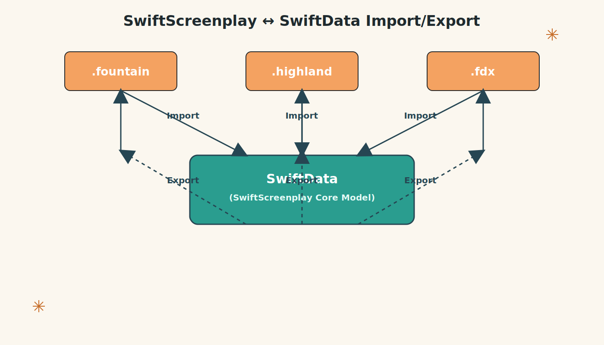

# SwiftGuion

##### Guión means "screenplay" in Spanish.



[](https://github.com/intrusive-memory/SwiftGuion/actions/workflows/tests.yml)

A performant Swift parser for Fountain, FDX, and Highland files that creates SwiftData-compatible objects without modifying source files.

## Overview

SwiftGuion is a Swift conversion of the original Objective-C Fountain parser created by Nima Yousefi & John August using Claude Code 4.5 Sonnet. It parses Fountain-formatted screenplays into structured SwiftData objects in a performant, non-mutating way—leaving source files completely untouched while providing full access to screenplay structure, metadata, and analysis.

### Architecture

SwiftGuion uses an **immutable, thread-safe architecture** with clear separation between:
- **GuionParsedScreenplay**: Immutable, Sendable parsed screenplay (safe to pass between threads)
- **GuionDocumentModel**: SwiftData-backed mutable model for persistence
- **Explicit conversion methods** between immutable and mutable representations
- **TextPack bundle format** (.guion) for structured screenplay data with JSON exports

## Features

- **Non-mutating parsing**: Read and analyze screenplays without modifying source files
- **SwiftData-compatible objects**: Parse into structured models ready for SwiftData/CoreData integration
- **Performance-optimized**: Efficient line-by-line parsing for large screenplays
- Parse Fountain files and strings
- Support for all Fountain guión elements:
  - Scene Headings
  - Action
  - Character names
  - Dialogue
  - Parentheticals
  - Transitions
  - Dual Dialogue
  - Lyrics
  - Title Pages
  - Section Headings
  - Synopses
  - Notes and Comments
  - Boneyard (omitted content)
  - Page Breaks
  - Scene Numbers
  - Centered text

- **Format Support**:
  - **.fountain**: Native Fountain screenplay format
  - **.fdx**: Final Draft XML documents
  - **.highland**: Highland 2 ZIP archives
  - **.guion**: TextPack bundles with structured JSON exports

- **Two parser implementations**:
  - **FountainParser**: High-performance state machine parser (recommended)
  - **FDXParser**: Final Draft XML parser

- **Export capabilities**:
  - Write to Fountain, FDX, or TextPack formats
  - Export character data, locations, and outline structure as JSON

## Installation

Add SwiftGuion to your Swift package dependencies:

```swift
dependencies: [
    .package(url: "https://github.com/intrusive-memory/SwiftGuion.git", from: "1.0.0")
]
```

## Quick Start: GuionViewer

The fastest way to add screenplay viewing to your SwiftUI app:

```swift
import SwiftUI
import SwiftGuion

struct ContentView: View {
    let document: GuionDocumentModel  // or FountainScript, or URL

    var body: some View {
        GuionViewer(document: document)
            .frame(minWidth: 600, minHeight: 800)
    }
}
```

**GuionViewer** is a complete, drop-in SwiftUI component that provides:
- ✅ Support for all file formats (.guion, .fountain, .highland, .fdx)
- ✅ Hierarchical scene browser with chapters and scene groups
- ✅ Async file loading with progress indicators
- ✅ Built-in error handling and empty states
- ✅ Full accessibility support (VoiceOver, keyboard navigation)
- ✅ Optimized for large screenplays (200+ pages)

**See:** [GuionViewer API Documentation](Docs/GUION_VIEWER_API.md) for complete API reference.

**See:** [UI Components README](Sources/SwiftGuion/UI/README.md) for component details.

## Examples

### FountainDocumentApp - Document-Based macOS App with SwiftData

A complete example application demonstrating how to build a document-based macOS app that reads `.fountain`, `.highland`, and `.textbundle` files and parses them into SwiftData objects without modifying the source files.

**Location:** `Examples/FountainDocumentApp/`

**Features:**
- SwiftUI document-based architecture using `DocumentGroup`
- Full support for `.fountain`, `.highland`, and `.textbundle` file formats
- SwiftData integration for structured guión data
- **Non-destructive parsing**: Source files remain completely untouched
- Proper UTType declarations and Info.plist configuration
- Parse guión elements, title pages, and metadata into SwiftData entities
- Browse and view guión structure with navigation interface

**See:** [FountainDocumentApp README](Examples/FountainDocumentApp/README.md) for detailed documentation.

## Core Concepts

### Immutable vs Mutable Models

SwiftGuion separates **immutable parsing** from **mutable persistence**:

```swift
// Immutable, thread-safe screenplay (can pass between threads)
let screenplay = try GuionParsedScreenplay(file: "screenplay.fountain")

// Convert to SwiftData model for persistence
let document = await GuionDocumentModel.from(screenplay, in: context)

// Convert back to immutable form
let screenplay2 = document.toGuionParsedScreenplay()
```

### Supported File Formats

```swift
// Parse Fountain files
let fountain = try GuionParsedScreenplay(file: "screenplay.fountain")

// Parse Final Draft FDX files
let parser = FDXParser()
let fdxDoc = try parser.parse(data: fdxData, filename: "screenplay.fdx")
let screenplay = GuionParsedScreenplay(filename: "screenplay.fdx",
                                       elements: fdxDoc.elements,
                                       titlePage: fdxDoc.titlePage)

// Parse Highland archives
let highland = try GuionParsedScreenplay(highland: highlandURL)

// Parse TextPack bundles (.guion)
let textpack = try GuionParsedScreenplay(textBundle: textpackURL)
```

## Usage

### Parsing a Fountain file

```swift
import SwiftGuion

// Parse using immutable GuionParsedScreenplay (thread-safe)
let screenplay = try GuionParsedScreenplay(file: "/path/to/screenplay.fountain")

// Access elements
for element in screenplay.elements {
    print("\(element.elementType): \(element.elementText)")
}

// The original file remains completely untouched
// All data is parsed into immutable, Sendable objects in memory
```

### Parsing a Fountain string

```swift
let fountainText = """
Title: My Screenplay
Author: Your Name

INT. COFFEE SHOP - DAY

A screenwriter sits at a laptop, typing furiously.

SCREENWRITER
This is going to be great!
"""

let screenplay = try GuionParsedScreenplay(string: fountainText)
```

### Accessing parsed guión elements

```swift
for element in screenplay.elements {
    print("\(element.elementType): \(element.elementText)")
}

// Access title page
for page in screenplay.titlePage {
    for (key, values) in page {
        print("\(key): \(values.joined(separator: ", "))")
    }
}
```

### Writing to Fountain format

```swift
// Get the full document as a string
let fountainOutput = screenplay.stringFromDocument()

// Write to file
try screenplay.write(toFile: "/path/to/output.fountain")

// Write to URL
let url = URL(fileURLWithPath: "/path/to/output.fountain")
try screenplay.write(to: url)
```

### Working with TextPack Format (.guion)

TextPack is SwiftGuion's native bundle format with structured JSON exports:

```swift
// Create a TextPack bundle
let textPack = try TextPackWriter.createTextPack(from: screenplay)

// TextPack structure:
// MyScript.guion/
//   ├── info.json              # Metadata (version, dates, filename)
//   ├── screenplay.fountain    # Complete screenplay
//   └── Resources/
//       ├── characters.json    # Character dialogue counts, scene appearances
//       ├── locations.json     # Location data with INT/EXT, time-of-day
//       ├── elements.json      # All screenplay elements with IDs
//       └── titlepage.json     # Title page entries

// Read a TextPack bundle
let screenplay = try TextPackReader.readTextPack(from: fileWrapper)

// Access structured resources
if let characters = TextPackReader.readCharacters(from: textPack) {
    for char in characters.characters {
        print("\(char.name): \(char.dialogueLines) lines in \(char.scenes.count) scenes")
    }
}

if let locations = TextPackReader.readLocations(from: textPack) {
    for loc in locations.locations {
        print("\(loc.lighting) \(loc.scene) - \(loc.timeOfDay ?? "")")
    }
}
```

### Getting Content from Any Format

```swift
let script = FountainScript()

// Get content URL for any supported format
let fountainURL = URL(fileURLWithPath: "/path/to/script.fountain")
let contentURL = try script.getContentUrl(from: fountainURL)
// Returns: /path/to/script.fountain

let textbundleURL = URL(fileURLWithPath: "/path/to/script.textbundle")
let contentURL = try script.getContentUrl(from: textbundleURL)
// Returns: /path/to/script.textbundle/script.fountain (or .md if no .fountain exists)

let highlandURL = URL(fileURLWithPath: "/path/to/script.highland")
let contentURL = try script.getContentUrl(from: highlandURL)
// Returns: URL to the .fountain or .md file inside the extracted archive

// Get content as a string
let content = try script.getContent(from: fountainURL)
// For .fountain files: Returns body content without front matter
// For .textbundle/.highland: Returns complete file content

// Get guión elements, parsing if needed
let elements = try script.getGuionElements()
// Returns existing elements if available, or parses from cached content

// Parse from a URL if elements don't exist
let emptyScript = FountainScript()
let elements = try emptyScript.getGuionElements(from: fountainURL)
// Reads content using getContent() and parses it
```

### Working with TextBundles

SwiftGuion supports reading and writing `.fountain` files within TextBundle/TextPack containers. Reading is non-destructive—source bundles are never modified during parsing.

```swift
import SwiftGuion

// Read a .fountain file from a TextBundle
let script = try FountainScript(textBundleURL: URL(fileURLWithPath: "/path/to/script.textbundle"))

// Write to a new TextBundle with a .fountain file
let outputURL = try script.writeToTextBundle(
    destinationURL: URL(fileURLWithPath: "/path/to/destination"),
    fountainFilename: "screenplay.fountain"
)

// Write to TextBundle with resources (characters.json, outline.json)
let bundleURL = try script.writeToTextBundleWithResources(
    destinationURL: URL(fileURLWithPath: "/path/to/destination"),
    name: "screenplay",
    includeResources: true
)
```

### Working with Highland Files

SwiftGuion supports reading and writing Highland 2 files (`.highland`), which are ZIP archives containing TextBundles with screenplay data and resources. Reading is non-destructive—source archives are never modified during parsing.

```swift
import SwiftGuion

// Read a .highland file
let script = try FountainScript(highlandURL: URL(fileURLWithPath: "/path/to/script.highland"))

// Write to a new Highland file with resources
let highlandURL = try script.writeToHighland(
    destinationURL: URL(fileURLWithPath: "/path/to/destination"),
    name: "screenplay",
    includeResources: true
)
```

**Note:** Highland files may contain either `.fountain` files or `text.md`/`text.markdown` files. The loader automatically detects the correct format.

### Using FountainDocument for SwiftUI Document-Based Apps

SwiftGuion includes `FountainDocument`, a `ReferenceFileDocument` implementation that enables you to build document-based apps supporting `.fountain`, `.highland`, and `.textbundle` files. Parsing is completely non-destructive—source files are never modified.

```swift
import SwiftUI
import SwiftGuion

@main
struct MyApp: App {
    var body: some Scene {
        DocumentGroup(newDocument: { FountainDocument() }) { file in
            ContentView(document: file.$document)
        }
    }
}

struct ContentView: View {
    @Binding var document: FountainDocument

    var body: some View {
        VStack {
            Text("Title: \(document.script.filename ?? "Untitled")")
            Text("Elements: \(document.script.elements.count)")

            List(document.script.elements, id: \.elementText) { element in
                VStack(alignment: .leading) {
                    Text(element.elementType)
                        .font(.caption)
                        .foregroundColor(.secondary)
                    Text(element.elementText)
                }
            }
        }
    }
}
```

**Document Type Configuration (Info.plist):**

```xml
<key>CFBundleDocumentTypes</key>
<array>
    <dict>
        <key>CFBundleTypeExtensions</key>
        <array><string>fountain</string></array>
        <key>CFBundleTypeName</key>
        <string>Fountain Screenplay</string>
        <key>CFBundleTypeRole</key>
        <string>Editor</string>
        <key>LSItemContentTypes</key>
        <array><string>com.quote-unquote.fountain</string></array>
        <key>LSHandlerRank</key>
        <string>Owner</string>
    </dict>
    <!-- Add similar entries for .highland and .textbundle -->
</array>

<key>UTImportedTypeDeclarations</key>
<array>
    <dict>
        <key>UTTypeIdentifier</key>
        <string>com.quote-unquote.fountain</string>
        <key>UTTypeConformsTo</key>
        <array>
            <string>public.plain-text</string>
            <string>public.text</string>
        </array>
        <key>UTTypeTagSpecification</key>
        <dict>
            <key>public.filename-extension</key>
            <array><string>fountain</string></array>
        </dict>
    </dict>
    <!-- Add similar entries for .highland and .textbundle -->
</array>
```

**See the complete example:** [FountainDocumentApp](Examples/FountainDocumentApp/) demonstrates full SwiftData integration with non-destructive document parsing.

### Extracting Character Information

Generate a character list with dialogue statistics and scene appearances.

```swift
// Extract all characters from the script
let characters: CharacterList = script.extractCharacters()

// Access character information
for (name, info) in characters {
    print("\(name):")
    print("  Lines: \(info.counts.lineCount)")
    print("  Words: \(info.counts.wordCount)")
    print("  Scenes: \(info.scenes)")
}

// Write characters to JSON
try script.writeCharactersJSON(toFile: "/path/to/characters.json")
try script.writeCharactersJSON(to: URL(fileURLWithPath: "/path/to/characters.json"))
```

**Character JSON Format:**
```json
{
  "CHARACTER NAME": {
    "color": null,
    "counts": {
      "lineCount": 82,
      "wordCount": 558
    },
    "gender": {
      "unspecified": {}
    },
    "scenes": [0, 1, 3, 4, 10, 11]
  }
}
```

### Extracting Outline Structure

Generate a hierarchical outline of the screenplay structure with parent-child relationships.

```swift
// Extract the outline
let outline: OutlineList = script.extractOutline()

// Access outline elements
for element in outline {
    print("[\(element.level)] \(element.type): \(element.string)")
}

// Access parent-child relationships
for element in outline {
    if let parent = element.parent(from: outline) {
        print("\(element.string) is child of \(parent.string)")
    }
    
    let children = element.children(from: outline)
    if !children.isEmpty {
        print("\(element.string) has \(children.count) children")
    }
}

// Create a tree structure for hierarchical processing
let tree = outline.tree()
if let root = tree.root {
    print("Root: \(root.element.string)")
    print("Tree has \(tree.allNodes.count) total nodes")
    print("Tree has \(tree.leafNodes.count) leaf nodes")
}

// Write outline to JSON
try script.writeOutlineJSON(toFile: "/path/to/outline.json")
try script.writeOutlineJSON(to: URL(fileURLWithPath: "/path/to/outline.json"))
```

**Outline JSON Format:**
```json
[
  {
    "id": "UUID-STRING",
    "index": 0,
    "isCollapsed": false,
    "level": 1,
    "range": [0, 12],
    "rawString": "# My Screenplay",
    "string": "My Screenplay",
    "type": "sectionHeader",
    "sceneDirective": null,
    "sceneDirectiveDescription": null,
    "parentId": null,
    "childIds": ["uuid-chapter1", "uuid-chapter2"],
    "isEndMarker": false
  },
  {
    "id": "uuid-chapter1",
    "index": 1,
    "isCollapsed": false,
    "level": 2,
    "range": [238, 22],
    "rawString": "## CHAPTER 1",
    "string": "CHAPTER 1",
    "type": "sectionHeader",
    "sceneDirective": null,
    "sceneDirectiveDescription": null,
    "parentId": "UUID-STRING",
    "childIds": ["uuid-music"],
    "isEndMarker": false
  },
  {
    "id": "uuid-music",
    "index": 2,
    "isCollapsed": false,
    "level": 3,
    "range": [400, 35],
    "rawString": "### MUSIC: Jazz plays softly",
    "string": "MUSIC",
    "type": "sectionHeader",
    "sceneDirective": "MUSIC",
    "sceneDirectiveDescription": "Jazz plays softly",
    "parentId": "uuid-chapter1",
    "childIds": [],
    "isEndMarker": false
  },
  {
    "id": "uuid-end",
    "index": 3,
    "isCollapsed": false,
    "level": 2,
    "range": [600, 18],
    "rawString": "## END CHAPTER 1",
    "string": "END CHAPTER 1",
    "type": "sectionHeader",
    "sceneDirective": null,
    "sceneDirectiveDescription": null,
    "parentId": null,
    "childIds": [],
    "isEndMarker": true
  }
]
```

**Outline Element Types:**
- `sectionHeader`: Section headings with hierarchical levels:
  - **Level 1**: Main title (only one allowed, auto-generated from script name if missing)
  - **Level 2**: Chapter-level headings (`##`) and END markers (`## END ...`)
  - **Level 3**: Scene directive headings (`###`) - first word before colon becomes the directive name
  - **Level 4+**: Additional nested section levels
- `sceneHeader`: Scene headings (INT/EXT, etc.) at level 4
- `note`: Bracketed notes (`[[NOTE: ...]]`) at level 5
- `blank`: Final element marking end of document (level -1)

**Parent-Child Relationships:**
- Level 2 elements (chapters) are children of level 1 (main title)
- Level 3 elements (scene directives) are children of level 2 (chapters)
- Level 4 elements (scene headers) are children of level 3 (scene directives)
- END markers (`## END ...`) do not participate in the parent-child hierarchy

## API Reference

### GuionViewer

Complete drop-in SwiftUI component for viewing screenplay documents.

**Platform:** macOS 14.0+, iOS 17.0+

**Initializers:**
- `init(document: GuionDocumentModel)`: Create from SwiftData document
- `init(script: GuionParsedScreenplay)`: Create from pre-parsed screenplay
- `init(fileURL: URL)`: Async load from file (.fountain, .highland, .fdx, .guion)
- `init(browserData: SceneBrowserData)`: Create from pre-extracted data

**Example:**
```swift
// From SwiftData document
GuionViewer(document: document)

// From file URL (async loading)
GuionViewer(fileURL: URL(fileURLWithPath: "screenplay.fountain"))

// From pre-parsed screenplay
let screenplay = try GuionParsedScreenplay(file: "screenplay.fountain")
GuionViewer(script: screenplay)
```

**See:** [GuionViewer API Documentation](Docs/GUION_VIEWER_API.md) for complete reference.

---

### FountainDocument

SwiftUI document wrapper for `.fountain`, `.highland`, and `.textbundle` files.

**Protocol:** `ReferenceFileDocument`

**Static Properties:**
- `readableContentTypes`: `[UTType]` - Supports `.fountain`, `.highland`, `.textbundle`
- `writableContentTypes`: `[UTType]` - Can write all three formats

**Instance Properties:**
- `script`: `FountainScript` - The underlying FountainScript instance

**Usage:**
```swift
DocumentGroup(newDocument: { FountainDocument() }) { file in
    ContentView(document: file.$document)
}
```

### GuionParsedScreenplay

The main immutable, thread-safe class for working with parsed screenplays.

**Initialization:**
- `init(filename:elements:titlePage:suppressSceneNumbers:)`: Create from explicit data
- `init(file:parser:)`: Parse a .fountain file
- `init(string:parser:)`: Parse Fountain text from memory
- `init(highland:)`: Parse Highland .highland archive
- `init(textBundle:)`: Parse TextBundle/TextPack format

**Writing:**
- `stringFromDocument()`: Get the complete document as Fountain text
- `stringFromBody()`: Get just the body (no title page)
- `stringFromTitlePage()`: Get just the title page
- `write(toFile:)`: Write to a file path
- `write(to:)`: Write to a URL

**Analysis:**
- `extractCharacters()`: Returns `CharacterList` - dictionary of character names to character information
- `extractSceneLocations()`: Returns location data with INT/EXT, time-of-day, scene IDs
- `extractOutline()`: Returns `OutlineList` - array of outline elements with parent-child relationships
- `extractOutlineTree()`: Returns `OutlineTree` - hierarchical tree structure of outline elements

**Properties (all immutable):**
- `elements`: `[GuionElement]` - Array of parsed guión elements
- `titlePage`: `[[String: [String]]]` - Title page metadata
- `filename`: `String?` - Original filename if loaded from file
- `suppressSceneNumbers`: `Bool` - Whether to suppress scene numbers when writing

---

### GuionDocumentModel

SwiftData-backed mutable model for screenplay persistence.

**Conversion Methods:**
- `static func from(_:in:generateSummaries:)`: Create from GuionParsedScreenplay
- `func toGuionParsedScreenplay()`: Convert to immutable screenplay

**Properties:**
- `filename`: `String?` - Original filename
- `rawContent`: `String?` - Raw screenplay text
- `elements`: `[GuionElementModel]` - Parsed screenplay elements
- `titlePage`: `[TitlePageEntryModel]` - Title page metadata
- `suppressSceneNumbers`: `Bool` - Scene number flag

**Methods:**
- `parseContent(rawContent:filename:contentType:modelContext:)`: Async parsing from raw text
- `extractCharacters()`: Extract character information from the document

---

### TextPack Format

**TextPackWriter:**
- `static func createTextPack(from: GuionParsedScreenplay)`: Create bundle from screenplay
- `static func createTextPack(from: GuionDocumentModel)`: Create bundle from SwiftData model

**TextPackReader:**
- `static func readTextPack(from:)`: Load as `GuionParsedScreenplay`
- `static func readTextPack(from:in:generateSummaries:)`: Load as `GuionDocumentModel` (SwiftData)
- `static func readCharacters(from:)`: Extract character JSON
- `static func readLocations(from:)`: Extract location JSON
- `static func readElements(from:)`: Extract elements JSON
- `static func readTitlePage(from:)`: Extract title page JSON

---

### FountainParser

High-performance state machine parser for Fountain format.

**Initialization:**
- `init(file:)`: Parse file at path
- `init(string:)`: Parse Fountain text

**Properties:**
- `elements`: `[GuionElement]` - Parsed screenplay elements
- `titlePage`: `[[String: [String]]]` - Extracted title page metadata

---

### FDXParser

Parser for Final Draft FDX XML format.

**Methods:**
- `func parse(data:filename:)`: Parse FDX XML into GuionElements
- Returns `FDXParsedDocument` with elements and metadata

### GuionElement

Represents a single element in a guión.

**Properties:**
- `elementType`: `String` - The type of element (e.g., "Scene Heading", "Action", "Dialogue", "Character", "Parenthetical", "Transition", "Section Heading", "Comment")
- `elementText`: `String` - The text content
- `isCentered`: `Bool` - Whether the text is centered
- `sceneNumber`: `String?` - Scene number (for scene headings)
- `isDualDialogue`: `Bool` - Whether this is dual dialogue
- `sectionDepth`: `UInt` - Depth of section heading (1 for `#`, 2 for `##`, etc.)

### CharacterInfo

Information about a character extracted from the guión.

**Properties:**
- `color`: `String?` - Optional color metadata
- `counts`: `CharacterCounts` - Dialogue statistics
  - `lineCount`: `Int` - Number of dialogue blocks
  - `wordCount`: `Int` - Total words spoken (including parentheticals)
- `gender`: `CharacterGender` - Gender specification (currently always `unspecified`)
- `scenes`: `[Int]` - Array of scene indices where character appears

### OutlineElement

Represents a structural element in the guión outline with parent-child relationships.

**Properties:**
- `id`: `String` - Unique UUID for this element
- `index`: `Int` - Sequential index in the outline
- `isCollapsed`: `Bool` - UI hint for collapsible display (always `false`)
- `level`: `Int` - Hierarchical level (1 for main title, 2 for chapters, 3 for scene directives, 4 for scenes, 5 for notes, -1 for blank end marker)
- `range`: `[Int]` - Character position `[start, length]` in source text
- `rawString`: `String` - Original formatting (e.g., `"## CHAPTER 1"` or `"### MUSIC: Jazz plays softly"`)
- `string`: `String` - Clean display text (e.g., `"CHAPTER 1"` or `"MUSIC"`)
- `type`: `String` - Element type (`"sectionHeader"`, `"sceneHeader"`, `"note"`, `"blank"`)
- `sceneDirective`: `String?` - For level 3 scene directives, the directive name (e.g., `"MUSIC"`, `"SOUND"`)
- `sceneDirectiveDescription`: `String?` - For level 3 scene directives, the full description after the colon
- `elementType`: `String` - Always returns `"outline"` for API compatibility with `GuionElement`
- `parentId`: `String?` - ID of the parent element in the hierarchy
- `childIds`: `[String]` - Array of child element IDs
- `isEndMarker`: `Bool` - True if this is an END chapter marker (e.g., `"## END CHAPTER 1"`)

**Computed Properties:**
- `isSceneDirective`: `Bool` - Returns true if this is a scene directive (level 3 section header)
- `isChapter`: `Bool` - Returns true if this is a chapter-level header (level 2)
- `isMainTitle`: `Bool` - Returns true if this is the main title (level 1)

**Methods:**
- `parent(from: OutlineList)`: `OutlineElement?` - Get the parent element from the outline list
- `children(from: OutlineList)`: `[OutlineElement]` - Get all direct children elements from the outline list
- `descendants(from: OutlineList)`: `[OutlineElement]` - Get all descendant elements (children, grandchildren, etc.)

### OutlineTree

Tree structure for hierarchical processing of outline elements.

**Properties:**
- `root`: `OutlineTreeNode?` - The root node of the tree (usually the main title)

**Methods:**
- `init(from: OutlineList)` - Create a tree from an outline list
- `node(for: String)`: `OutlineTreeNode?` - Find a node by element ID
- `allNodes`: `[OutlineTreeNode]` - Get all nodes in the tree (flattened)
- `leafNodes`: `[OutlineTreeNode]` - Get all leaf nodes (nodes without children)

### OutlineTreeNode

Node in the outline tree structure.

**Properties:**
- `element`: `OutlineElement` - The outline element this node represents
- `children`: `[OutlineTreeNode]` - Child nodes
- `parent`: `OutlineTreeNode?` - Parent node (weak reference)

**Computed Properties:**
- `descendants`: `[OutlineTreeNode]` - All descendant nodes
- `hasChildren`: `Bool` - Whether this node has children
- `depth`: `Int` - Depth of this node in the tree (root = 0)

**Methods:**
- `addChild(_: OutlineTreeNode)` - Add a child node

**Usage:**
```swift
// Create tree structure
let outline = script.extractOutline()
let tree = outline.tree()

// Navigate the tree
if let root = tree.root {
    print("Root: \(root.element.string)")
    for chapter in root.children {
        print("  Chapter: \(chapter.element.string)")
        for directive in chapter.children {
            print("    Directive: \(directive.element.string)")
        }
    }
}
```

## Package Structure

SwiftGuion is organized into functional modules:

```
Sources/SwiftGuion/
├── Core/                  # GuionParsedScreenplay (immutable, Sendable)
├── FileFormat/            # Guion native .guion TextPack format
├── ImportExport/          # Format parsers and writers (Fountain, FDX, Highland)
├── Analysis/              # Scene analysis, character extraction, UI data
└── UI/                    # SwiftUI components (GuionViewer, widgets)
```

**Key Dependencies:**
- **ZIPFoundation**: Highland archive extraction
- **SwiftData**: Document persistence (macOS 14.0+)
- **SwiftUI**: User interface components (macOS 14.0+)

## License

MIT License - Copyright (c) 2012-2013 Nima Yousefi & John August

See LICENSE file for details.

## Credits

Original Objective-C implementation by Nima Yousefi & John August
Swift conversion (c) 2025

Fountain specification: https://fountain.io
